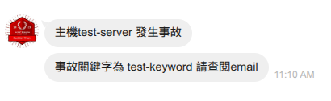

# 2025 Red Hat TAM Day @Taiwan

## 打造零中斷維運能力：RHEL 結合 AI 與 MCP 實戰解密 實機工作坊


## Workshop 環境說明

這個workshop於雲端打造，您會需要存取下列服務來完成今天的練習。

1. Bastion主機，及其帳號、密碼
2. AAP圖形化界面，及其帳號、密碼
3. Git Server (Gitea)的圖形化界面，及其帳號、密碼

各服務的帳號雖然不同，但都使用<u>相同的密碼</u>。所有的帳號、密碼都

其他資訊(比方說網路版的VS Code)在我們platform lab不是個必備的工具。但您可以使用瀏覽器連線到VS Code網路版，在VS Code的terminal裏進行操作。或直接使用ssh連線到bastion主機進行操作。

## 連線到workshop

如前所述，您有二種連線到workshop的方式。

第一種：使用瀏覽器連線到VS Code網頁版，以它的terminal進行操作。

第二種：(建議的方法) 直接從您的筆記型電腦，直接使用ssh連線到workshop，比方說(請更換bastion主機名稱)：
```
$　ssh lab-user@bastion.gm9xr.sandbox5192.opentlc.com
```

連線到Bastion後，**<u>請切換到tamday子目錄。此為今天workshop的工作目錄。</u>**

```pseudocode
[lab-user@bastion ~]$ cd tamday
[lab-user@bastion tamday]$
```

當您在workshop裏想要執行一些指令，一時背不起來，可考慮執行我們提供的helpme小工具，把workshop裏可能會用到的指令寫在這裏。

```pseudocode
[lab-user@bastion tamday]$ helpme
重啟prometheus and alertmanager
$ podman kube play --down ~/.config/containers/ansible-kubernetes.d/prometheus.yml
(以下略)
```
## 暖身運動：測試RHEL LightSpeed AI小幫手

執行下列指令，測試RHEL LightSpeed是否能與我們交談。而Lightspeed的執行檔是`/usr/bin/c`。請看執行範例：

```pseudocode
[lab-user@bastion tamday]$ c '應使用什麼指令，調查目前檔案系統的使用狀況?'
⁺₊+ Asking RHEL Lightspeed
(以下略)
```

(您會發現Lightspeed的回覆不夠新…但這也是AI現實狀況，請您包涵。)

再接著讓 Lightspeed幫我們分析一段系統訊息

```pseudocode
[lab-user@bastion tamday]$ sudo tail -n 5 /var/log/messages | c '這五行訊息在做什麼?請用中文說明。'
```

或請Lightspeed做設定檔的分析-比方說，問AI有關nsswitch.conf的內容：
```pseudocode
[lab-user@bastion tamday]$ cat /etc/nsswitch.conf | grep hosts | c "這是我的名稱解析順序設定，來自/etc/nsswitch.conf，請說明"
```

Lightspeed使用的大語言模型是建置在Red Hat的內部環境裏。為此，lightspeed工具所在的主機，<u>必先向Red Hat網路註冊</u>。

只有註冊過的主機，才能將查詢送到Red Hat的環境裏的LLM做進一步處理，並回傳結果給我們。

我們可以利用下列指令看到註冊現況：(您看到的資料，會與下面的範例不同)

```pseudocode
[lab-user@bastion tamday]$ sudo subscription-manager identity
system identity: 5afda3b4-f0fe-4de1-8811-c6d6f3f70e35
name: bastion.gm9xr.internal
org name: 6265347
org ID: 6265347
```

此外，您若要在公司做同樣的測試，需在RHEL 9.6+ or RHEL 10的主機上，才能享有此功能。

   > [!tip]
   > 您得(a) 先安裝 command-line-assistant套件，並且要(b)確保RHEL已向Satellite ver 6.17+ 或Red Hat雲端註冊，才能使用Lightspeed。

## 本日lab總覽

為了讓大家分配lab的實作時間，請參考下表：

| Lab序號 | 名稱                                 | 一定要做嗎?                                              | 預估時間(分鐘) |
| ------- | ------------------------------------ | -------------------------------------------------------- | -------------- |
| １      | 建置Event-driven的環境               | 是，沒有做整個demo並不完整                               | 20             |
| ２      | 測試Event-Driven Ansible             | 是，驗證前面的demo                                       | 5              |
| ３      | 對監控系統加一個新的事故關鍵字       | 否，但日後想建置相似的環境時，會用到此段內容             | 15             |
| ４      | 在Ansible Workflow加一個通知         | 否，但日後想建置相似的環境時，會用到此段內容             | 10             |
| ５      | 看完信後，以AI工具進行調查           | 否，但滿實用，而且也應該是未來的工作主流                 | 5              |
| 6       | 以AI工具對Ansible Controller進行操作 | 否，但很建議試做，因為這樣的組合目前在網際網路上還很少見 | 5              |

> [!tip]
>
> 如果做lab遇到問題，怎麼辦?
>
> 請您舉手，我們隨侍在側的TAM同仁會前來幫忙。

## Lab 1：建置Event-driven的環境

您的同事昨天已經寫好了一個Event-driven Ansible(EDA)的rulebook，用來承接公司裏監控系統發送的事件。

當事件被EDA收進來後，按規劃會連向Ansible Controller執行後續的工作。

這工作是呼叫playbook，執行RHEL Light Speed AI以分析LOG裏的細節，還評估效能數據的表現。

但這個同事今天臨時請假沒來，老闆要您幫忙完成這個rulebook的設定作業。

所以讓我們開始動工吧!

### 檢視Rulebook的內容

Ansible Rulebook就像Ansible Playbook一樣，是個yaml檔案。但它和playbook不一樣的地方，是它規範了會監聽的事件來源，以及收到來源後得符合什麼條件才能往下執行，而執行時要執行什麼工作。

接下來解說Rulebook的內容：

1. 請使用您筆電的瀏覽器，登入Git Server的圖形化界面。
2. 登入Git Server (本例為Gitea服務)，**<u>使用dev-admin帳號</u>**，及我們workshop的萬用密碼。
3. 在畫面右手邊，會有Repositories的清單。請點選dev-admin/pf_rulebook
4. 再畫面左手邊，再點選rulebooks目錄。
   這是必要的資料夾設計。如果您的rulebooks不放在這裏，AAP環境就會有存取的問題。
5. 在rulebooks目錄下只有一個唯一的webhook-prometheus.yml。請點開它的鏈結閱讀其內容。


觀察的重點為：

1. 連線的主機名稱：如同Ansible playbook一樣，我們會選定一個要連線後自動化的對象。但在EDA的GUI環境下，這個參數會被忽略。會在GUI環境由別其他設定代替。
2. 監聽對象：我們使用了最通用的webhook，監聽TCP port 5000。EDA還有近二十種監聽來源可供選擇。
3. 過濾條件：不是所有的事件我們都會有所反應。這裏界定了如果送來的事件中，其中payload的資料欄位裏，有一個alerts[0].status的內容為firing才會將事件往下送，交由「actions」段落的三個工作來應對。
4. 動作一：print_event其實是一個debug的工作，把送進來的event的內容整個傾印，非必要。
5. 動作二：更精細的debug，我們故意要印出送來的事件中某特定的資料。將來會交給Ansible Controller對特定主機搜集資訊，並且對特定主題做初步研究。
6. 動作三：這是這個rulebook有實質意義的行為，它會執行一個Ansible Controller裏的一個Workflow Template，名稱是"collect-evidence-and-let-ai-analyze"。它同時會傳遞二個變數給Ansible Controller，一個是報警的主機名稱，另一個是事故的關鍵字。

了解了EDA rulebook的內容後，接下來我們會要它在EDA環境7x24的日夜執行，以等待事件的發生。

### 檢查Event-Driven Ansible目前現況

1. 請使用您筆電的瀏覽器，登入AAP的圖形化界面，<u>使用的帳號是admin</u>。

2. 在左手邊的功能欄中，有一區為Automation Decisions，這就是Event-driven Ansible的設定區域。

   請進行以下的觀察-

   觀察A：點選Projects(1)再點選(2) Local Gitea。

   這是讓EDA去Git Server同步rulebook所使用的物件。

   

   

   觀察B：同樣在左手邊功能欄，往下滑有個"Decision Environments"(1)項目，簡稱DE。

   點開後會有二個DE，我們將使用"Default Decision Environment"(2)做Rulebook執行的環境。

   

   

   觀察C：繼續前述類似的操作：
   有個"infrastructure"(1), "Credentials"(2)的項目在左手邊。

   記錄了EDA要連向Git Server所需的帳號密碼(3)，以及連向Ansible Controller所需的帳號密碼(4)。這裏也同時設定了EDA要連向那一個Ansible Controller對其發號施令。

   

### 啟動一個Rulebook

請在左手邊功能欄點選「Rulebook Activations」，在右邊按下「Create rulebook activation」按鍵。


請填入或檢視下列六個設定：

1) rulebook名稱：<span style=color:red>請一定、一定、一定要填這個名字，**platform-eda**。</span>
   因為在Ansible on OCP環境，我們稍後要開設一個route物件，把這個rulebook產生的service物件對外公開。我們會提供一個yaml file建置這個route物件，而這個yaml檔案我們已經寫死了platform-eda這名字，為此請一定要填這個名字。

   <span style=color:orange>若在您公司裏的環境，就可以和OCP管理員討論這方面的設定。若您是OCP專家，也可以在稍後的步驟建OCP route物件時，對應這裏設定做名稱更換</span>。
   若是您的AAP建置在RHEL環境，則取什麼rulebook名字就沒那麼重要，方便管理員識別即可。
   
2) Organization設為Default即可。這設定只是做access control的管理-誰可以看或更動這裏的設定。

3) Project：能從那裏取得rulebook? 在workshop環境我們使用Local Gitea project來取得。

4) Rulebook：為了這個workshop準備的rulebook

5) Credential：為了要連線git server所需的帳號密碼

6) Decision Environment：為了要執行rulebook的容器環境


設定六項後，請按下方的"Create rulebook activation"。

再點選左手邊"Rulebook activations"，等約一分鐘以內，即可以看到rulebook啟動的狀態。


上面四個觀察重點：

1. 切入觀察rulebook運作的地方
2. 我們剛剛建置的rulebook 'platform-eda'。這裏EDA controller會持續監控所有運行中的rulebook，連我們剛建好的總共有四個事件來源。
   ( 不過我們這個workshop只關心platfom-eda這個來源:p )
3. 狀態顯示為"Running"。若沒有問題，它會7x24持續監控著事件來源。
4. 在rulebook裏有生效的rule數量。

### 在AAP on OCP環境建置一個route物件

由於本次的workshop環境，是利用Single Node OCP建置AAP環境。

因此前述的EDA把rulebook跑起來之後，外面的人還無法直接將事件送進EDA。
為此，我們需要在AAP on OCP多做一個動作-建一個route物件：

```pseudocode
[lab-user@bastion tamday]$ pwd
/home/lab-user/tamday

[lab-user@bastion tamday]$ oc create -f platform-eda.route.yml
route.route.openshift.io/platform-eda created

[lab-user@bastion tamday]$ oc get routes -n aap | grep platform
platform-eda     platform-eda-aap.apps.cluster-p8fxl.p8fxl.sandbox5183.opentlc.com            platform-eda             platform-eda-5000   edge/Redirect   None
```

(您的route物件名稱，會和範例不同))

前述的指令讓EDA可以在OCP環境，傾聽TCP port 5000。至此整個workshop的EDA環境建置完畢。


## Lab 2：測試Event-Driven Ansible

現在您完成了EDA的設定，老闆說想測測看。

老闆說：「我們這個測試方法，會RHEL注入模擬的事件，也就是把關鍵字寫進/var/log/messages，RHEL的預設logging。配合mtail服務，將能捕捉這些關鍵字並記錄它的出現次數。稍後Prometheus就會注意到這個變化，<u>並通知EDA</u>，完成了一個Event-driven的過程。」

現在我們來體驗一下這個過程吧!

### 步驟一：在Bastion主機上，執行pfworkshop script，注入模擬的事故關鍵字

```pseudocode
[lab-user@bastion tamday]$ pfworkshop
請選一個測試個案-
1. blockFor120seconds
2. segfault
3. lockup
4. mcelog
5. abort
6. outOfMemory
7. timeIsNotSync
請輸入對應編號?輸入後程式會在/var/log/messages插入測試個案的關鍵字。 1
目前時間：20250903011345
選擇測試個案：blocked for more than 120
應為第一次執行，mtail沒有找到blocked for more than 120之前出現的記錄
於rsyslog留下事件
rsyslog_keyword_last_seen{keyword="blocked for more than 120",prog="rsyslog.mtail"} 1.756862025e+09
rsyslog_keyword_total{keyword="blocked for more than 120",prog="rsyslog.mtail"} 3
```

現在我們在/var/log/messages寫入了"Blocked for more than 120 seconds"的關鍵字-注入了三行。
```pseudocode
[lab-user@bastion tamday]$ sudo grep 'blocked for more than 120' /var/log/messages
Sep  3 01:13:45 bastion root[2928]: kernel: INFO: task VM Thread:3858337 blocked for more than 120 seconds.
Sep  3 01:13:45 bastion root[2928]: kernel: INFO: task C2 CompilerThre:3858344 blocked for more than 120 seconds.
Sep  3 01:13:45 bastion root[2928]: kernel: INFO: task VM Periodic Tas:3858354 blocked for more than 120 seconds.
```

由於bastion主機的時區沒有調整，因此01:13:45是UTC時間。

### 步驟二：觀察/var/log/messages傳輸確認狀態

若您重覆執行前述`sudo grep 'blocked for more than 120' /var/log/messages`指令，還會見到`msg="Notify success"`的訊息

```pseudocode
Sep  3 01:13:51 bastion alertmanager-alertmanager[1420]: time=2025-09-03T01:13:51.196Z level=DEBUG source=notify.go:876 msg="Notify success" component=dispatcher receiver
(以下略)
```

Notify Success即表示，監控系統經過層層轉發，已經通知EDA，並得到肯定的回覆，因此這裏會有「Notify success」的狀態。

前面log中出現的alertmanager-alertmanager，是一個以容器型式運行的服務，因此執行
```
[lab-user@bastion tamday]$ podman logs -f alertmanager-alertmanager
```

也可以從輸出的log中，找到"Notify success"這個字。

### 步驟三：檢視AI分析報告郵件二份

從模擬事故發生，約在五分鐘之內，您可以執行mail工具，會發現有二封信：

```pseudocode
[lab-user@bastion tamday]$ mail
s-nail version v14.9.22.  Type `?' for help
/var/spool/mail/lab-user: 6 messages 1 new 5 unread
 U  1 System Monitor        2025-09-03 01:14   51/3267  "[ALERT] 事故 blocked for more than 120 的效能初步分析"
 U  2 System Monitor        2025-09-03 01:14   90/5454  "[ALERT] 事故 blocked for more than 120 的log細節與初步分析"
```

您會得到：

- 從第一封信您會看到，在事發當下Ansible主動連回告警的主機，搜集該主機的效能數據，還有RHEL light speed AI小幫手分析的結果，以輔佐管理員的調查。
- 開第二封信您會得到，事故關鍵字發生前的資訊，加上RHEL light speed AI小幫手分析LOG後的建議，還有TAM加註的處理建議。

這就是今天platform TAM's workshop第一情境：事故發生後的數分鐘，我們會收到告警，並搭配log以及效能數據的收集，加上AI的建議，還有TAM的經驗分享。

> [!tip]
>
> 文字界面的mail工具，它的常用指令是：
>
> h 看所有郵件的標題
>
> 13 看第13封信。直接敲數字就是看第幾封信。
>
> Enter 讀信
>
> d 刪信
>
> q 離開
>
> space 在讀長信時，按space換頁

### 步驟四：閱覽報告信的詳細內容

下面是一封通知信的範本內容，內容有「事故原始資料」「AI分析(有著This feature uses AI technology...的開頭那段)」和最底下的「TAM的分析」，共三個區塊。

```pseudocode
& 10
[-- Message 10 -- 59 lines, 5271 bytes --]:
Date: Wed, 03 Sep 2025 04:12:03 +0000
From: System Monitor <no-reply@localhost>
To: lab-user@bastion.596dc.sandbox534.opentlc.com
Subject: [ALERT] 事故 blocked for more than 120 的log細節與初步分析
Message-ID: <1756872723.299174.alert@bastion.596dc.sandbox534.opentlc.com>

===== 系統事故通知 =====

事故關鍵字: blocked for more than 120    <------------ 事故原始資料
偵測時間: Wed Sep  3 04:12:03 UTC 2025
主機名稱: bastion.596dc.sandbox534.opentlc.com
詳細資訊:
"來自RHEL LightSpeed 對LOG的分析"　　<------------ 以下是AI使用警語及AI分析，來自RHEL Lightspeed
(略)
This feature uses AI technology. Do not include any personal information or
other sensitive information in your input. Interactions may be used to improve
Red Hat's products or services.
────────────────────────────────────────────────────────────────────────

根據提供的系統記錄，問題似乎與 rsyslog 相關。記錄中提到 "blocked for more than 120" 這個關鍵字，這可能表示某些訊息已經被 rsyslog 阻止了超過 120 秒的時間。

根因分析：
(略)
"紅帽客戶技術經理(Technical Account Manager)的補充說明如下"  <------------ TAM的經驗補充
"常因儲存設備的輸入輸出卡住，而在log中看到blocked for more than 120 seconds的警訊。此問題應參考同時間的performance log來決定瓶頸，亦可參考https://access.redhat.com/solutions/31453"
--
此為自動化監控系統產生的通知
```

### 步驟五：事件觸發後到收到信，中間發生什麼事?

如果您想從頭了解整個事件觸發->Mtail服務舉報->Prometheus發現->轉告AlertManager->通知EDA->命令Ansible Controller做事->發送分析結果信件…這個複雜的流程，看圖最清楚了。

場景一：使用EDA+RHEL LightSpeed AI加速事故的處理


如果您希望了解其運作細節，可以連到Git Server，或是Ansible Controller, EDA controller等配置一探究竟。

我們在旁邊stand-by的TAM也會很樂意幫忙解說-只要您舉個手即可。


## Lab 3：對監控系統加一個新的事故關鍵字

別組的同事突然打電話過來：「早上有一台主機DNS服務掛掉了，這已經這個月的第三次出包了。雖然有緩解的方法，但通常出事時我們都不知道。聽說你可在監控系統加註監控關鍵字，幫我們提醒並搜集資訊?」

你回答：「是的，這很簡單!」

同事：「太好了!　下面是事件在/var/log/messages的原始資料。關鍵字我想加的是"failed, back trace"」

```pseudocode
Sep 1 3:34:45 rhel8 named-pkcs11[29928]: ../../../lib/dns-pkcs11/name.c:1116: REQUIRE((target != ((void *)0) && (__builtin_expect(((target) != ((void *)0)), 1) && __builtin_expect((((const isc__magic_t *)(target))->magic == (0x42756621U)), 1))) || (target == ((void *)0) && (__builtin_expect(((name->buffer) != ((void *)0)), 1) && __builtin_expect((((const isc__magic_t *)(name->buffer))->magic == (0x42756621U)), 1)))) failed, back trace
named[1514]: exiting (due to assertion failure)
```

你決定在mtail的監控字串中加一個，並且做個end-to-end的測試，讓EDA/Ansible能夠在出事時就提醒大家發生什麼事。

> [!tip]
>
> 或許這個例子用'due to assertion failure'也很有識別性。但用'failed, back trace'關鍵字，中間竟然有逗號，也是驗證mtail抓關鍵字的能力。

### 步驟一：修改mtail的監鍵字清單

請在bastion主機，執行下述指令：

```pseudocode
[lab-user@bastion tamday]$ sudo cp /opt/mtail/progs/rsyslog.mtail /opt/mtail/progs/rsyslog.mtail.backup09092025
[lab-user@bastion tamday]$ sudo vi /opt/mtail/progs/rsyslog.mtail
```

在設定檔的內容裏，找到下面的敘述

```pseudocode
# 正規表示式匹配keyword - 要加keyword要改下面這行
/(?i)\b(lockup|blocked for more than 120|segfault|abort|mcelog|invoked oom-killer|no majority)\b/ {
```

在no majority之後加入一個'|'以及新的關鍵字'failed, back trace'

```pseudocode
# 正規表示式匹配keyword - 要加keyword要改下面這行
/(?i)\b(lockup|blocked for more than 120|segfault|abort|mcelog|invoked oom-killer|no majority|failed, back trace)\b/ {
```

重啟mtail服務，簡單的透過mtail web界面做健檢-超重要：
```pseudocode
[lab-user@bastion tamday]$ sudo systemctl restart mtail
[lab-user@bastion tamday]$ curl -sk localhost:3903 | grep 'No compile errors'
No compile errors
```

### 步驟二：更動測試腳本與樣本檔

新建一個樣本測試檔案event.backtrace於~/tamday目錄下，內容如下所示：

```pseudocode
[lab-user@bastion tamday]$ cat ~/tamday/event.backtrace
__builtin_expect((((const isc__magic_t *)(name->buffer))->magic == (0x42756621U)), 1)))) failed, back trace
```

修改測試的script，方便我們持續測試
```pseudocode
[lab-user@bastion tamday]$ sudo vi /usr/local/bin/pfworkshop
```

改動一：新增選項`８. failedBackTrace`

```pseudocode
cat <<'MENU'
1. blockFor120seconds
2. segfault
3. lockup
4. mcelog
5. abort
6. outOfMemory
7. timeIsNotSync
8. failedBackTrace
MENU
```

改動二：新增`８) keyword`那一行

```pseudocode
case "$choice" in
  1) keyword="blocked for more than 120" ; file="/home/lab-user/tamday/event.blockFor120seconds" ;;
  2) keyword="segfault"                  ; file="/home/lab-user/tamday/event.segfault" ;;
  3) keyword="lockup"                    ; file="/home/lab-user/tamday/event.lockup" ;;
  4) keyword="mcelog"                    ; file="/home/lab-user/tamday/event.mcelog" ;;
  5) keyword="abort"                     ; file="/home/lab-user/tamday/event.abort" ;;
  6) keyword="invoked oom-killer"        ; file="/home/lab-user/tamday/event.outOfMemory" ;;
  7) keyword="no majority"               ; file="/home/lab-user/tamday/event.timeIsNotSync" ;;
  8) keyword="failed, back trace"        ; file="/home/lab-user/tamday/event.backtrace" ;;
  *) echo "無效選項：$choice" ; exit 1 ;;
esac
```

做完二個改動後，存檔後離開。

### 步驟三：變更Ansible Playbook，加強對新事件的說明

在每一次事件發生後，我們會發送二封email

- 一封記錄著事發當下幾分鐘後的效能數據，這次和lab 3沒有影響。
- 另一封記錄著log的AI分析，還有人類的分析。

我們要更動「人類的分析」這一塊，讓下次同仁收到告警的mail時，可以看到AI及「同仁加註的經驗談」。

首先我們要把playbook同步到bastion主機-<span style=color:red><u>請注意下面範例的git server的名稱要更改</u>：</span>

```pseudocode
[lab-user@bastion ~]$ cd tamday/
[lab-user@bastion tamday]$ git clone https://gitea.apps.cluster-p8fxl.p8fxl.sandbox5183.opentlc.com/dev-admin/pf_playbook
```

前面的動作會下載一個pf_playbook的資料夾到地端；我們要編輯的是「ask-light-speed-review-logs.yml」。

請往下捲動內容到66行的位置，複製"no majority"的task，共四行(66-69行)，再貼到它下面一點的位置，約71行開始的位置(71-75)。再修改複製好的內容，加上我們希望提醒未來同仁該如何應對的字句…成果應如下所示：

```pseudocode
 66     - name: Add Additional suggestion from Technical Account Manager for keyword "incident_keyword"
 67       ansible.builtin.set_fact:
 68         tamSuggestion: "因配置二個時間源，而這二個時間源在此時段給出不一樣的時間，造成主機同步困難。可參考https://access.redhat.com/solutions/4303901"
 69       when: incident_keyword == "no majority"
 70
 71     - name: Add Additional suggestion from Technical Account Manager for keyword "incident_keyword"
 72       ansible.builtin.set_fact:
 73         tamSuggestion: "因一個已知bug，DNS服務會當掉。可暫時透過修改/etc/resolv.conf後重啟named服務即可解決。原廠說明請見https://access.redhat.com/solutions/7065748"
 74       when: incident_keyword == "failed, back trace"
 75
 76     - name: Get current timestamp
 77       ansible.builtin.command: date "+%a %b %d %H:%M:%S %Y"
 78       register: current_date
 79       changed_when: false
```

> [!tip]
>
> 左方的數字是行數。是在vim編輯器裏，使用: set number方式顯現，請勿把行號輸入playbook裏面。

playbook被執行前，對playbook的語法檢查永遠是個好習慣。

```pseudocode
[lab-user@bastion tamday]$ ansible-playbook --syntax-check pf_playbook/ask-light-speed-review-logs.yml
[WARNING]: provided hosts list is empty, only localhost is available. Note that the implicit localhost does not match 'all'
playbook: pf_playbook/ask-light-speed-review-logs.yml
```

`ansible-playbook --syntax-check`指令若沒有報錯，表示我們加的四行格式沒錯。現在我們就能上傳它到git server了。

在切換到pf_playbook這個有執行過git的子資料夾下，我們將要執行的指令有三個

1. git add ask-light-speed-review-logs.yml 通知git指令我們要上傳變動的檔案名稱
2. git commit -m 'xxx' xxx是檔案變更的理由
   此時您會看到git聲稱我們之前沒有做username and hostname的設定；但我們可以接受它的預設值。
3. git push 將變更推回git server
   此時要輸入dev-admin這個git server的帳號與密碼。

全部的操作如下：

```pseudocode
[lab-user@bastion tamday]$ cd pf_playbook/
[lab-user@bastion pf_playbook]$ git add ask-light-speed-review-logs.yml
[lab-user@bastion pf_playbook]$ git commit -m 'add a new keyword back trace for named issue'
[main fda9e13] add a new keyword back trace for named issue
 Committer: Red Hat Demo Platform Student <lab-user@bastion.p8fxl.internal>
Your name and email address were configured automatically based
on your username and hostname. Please check that they are accurate.
You can suppress this message by setting them explicitly. Run the
following command and follow the instructions in your editor to edit
your configuration file:

    git config --global --edit

After doing this, you may fix the identity used for this commit with:

    git commit --amend --reset-author

 1 file changed, 6 insertions(+), 1 deletion(-)

[lab-user@bastion pf_playbook]$ git push
Username for 'https://gitea.apps.cluster-p8fxl.p8fxl.sandbox5183.opentlc.com': dev-admin
Password for 'https://dev-admin@gitea.apps.cluster-p8fxl.p8fxl.sandbox5183.opentlc.com':
(略)
To https://gitea.apps.cluster-p8fxl.p8fxl.sandbox5183.opentlc.com/dev-admin/pf_playbook
   8cef593..fda9e13  main -> main
```

### 步驟四：進行測試

讓我們在Bastion主機驗證結果吧!

```pseudocode
[lab-user@bastion tamday]$ pfworkshop
請選一個測試個案-
1. blockFor120seconds
2. segfault
3. lockup
4. mcelog
5. abort
6. outOfMemory
7. timeIsNotSync
8. failedBackTrace　　<---　我們新加的測試個案
請輸入對應編號?輸入後程式會在/var/log/messages插入測試個案的關鍵字。 8　　　<---　輸入８
```

再等待3-5分鐘，執行mail指令，即可收到告警信及其AI分析結果二封。

```pseudocode
[lab-user@bastion tamday]$ mail
(略)
▸N  7 System Monitor        2025-09-04 01:49   46/3343  "[ALERT] 事故 failed, back trace 的效能初步分析"
 N  8 System Monitor        2025-09-04 01:49   74/4958  "[ALERT] 事故 failed, back trace 的log細節與初步分析"
```

## Lab 4：在Ansible Workflow加一個通知

在某天會議中，有別組的主管說：要是事故出現時，能夠把事故訊息、AI分析一起發到LINE就好了。所以…

讓我們把既有的workflow加強一下，增加一個步驟：把事故訊息發送到LINE!

> [!note]
>
> 由於workshop限制，無法讓大家在會場一一設定個人的LINE來體驗，因此本段測試會把LINE訊息統一發給一個固定的LINE開發者帳號，並且只揭露基本資訊，沒有完整的AI分析-但實際上傳送事故相關資料到LINE，應該沒有問題。
> 又由於workshop環境沒有完整DNS名稱解析，所以傳到LINE上面的主機資訊永遠為localhost，而非真實主機名稱。但以workshop使用的playbook與mtail相關設定，是可以將事故主機完整地從頭到尾傳送。

### 步驟一：新建一個Job template

請按下列步驟，新建一個獨立的Job Template


接下來在新的Job template進行設定


1. 在Ansible Execution區塊點選Templates

2. 決定一個名字、您可以隨便取

3. Job Template的運行模式：請確定為Run

4. 選定Inventory。在這個workshop您得選"bastion"。

5. 選定playbook存放的來源。在這個workshop您得選"local gitea"。

6. 選定playbook：我們已經幫您準備好了，這個會以LINE API的方式傳送事故資料的playbook叫做「notifyLine.yml」。
   它已在事前同步在Git server，並同步至Ansible Controller了。

7. 選定Credential：由於notifyLine.yml裏面會使用LINE API的token，而這項機密資料是放在Git server的pf_playbook子目錄下的secret.yml加密檔案，在notifyLine.yml執行時會讀取。
   讀取時要解密secret.yml，因此我們要提供一個credential物件，型式是"Vault"，裏面內藏著能解開secret.yml的密碼。

8. 啟用Prompt on launch
   這個功能平常是讓playbook執行時，能讓人類在啟用時隨機更換變數內容。
   但在API呼叫時，這個功能會讓API更換變數內容。藉此，我們可以「接收」EDA傳送來的值，用來正確的表述出問題的主機名稱及事故代號。

9. 能接受臨時更改的變數清單
   這裏只有target and keyword二個變數能接受新傳進來的值，分別代表出問題的主機名稱及事故代號。在本次測試時，請參考上面的截圖，輸入

   ```yaml
   target: test-server
   keyword: test-keyword
   ```

   這也會是送到LINE上面的基本訊息。也歡迎您輸入其他有鑑別性質的資訊，比方說`target: AAA-Company`，`keyword: hellokitty`，但必須是yaml格式。

最後按下底下的「Create job template」完成建置。

### 步驟二：進行單元測試-驗證新建的Job template

點選右上角的「Launch Template」。此時會提示要不要改target and keyword的變數內容，可以改也可以按下方的「Next」按鍵繼續，以及下一頁的「Finish」鍵完成執行。

如果一切正常，您就會在下一頁看到畫面有Success的字樣。而LINE的發送結果，也會在某個TAM同仁的LINE頻道出現




### 步驟三：將新建的Job template加入既有的workflow

請依照下方順序，編輯既有的workflow 'collect-evidence-and-let-ai-analyze'：關鍵是選取這個workflow template之後，要點右上角的View workflow visualizer以了解整個自動化流程。


目前現有的流程如下：我們將在「Start」下面新增一步驟來傳訊息給Line。請點選"Add Step"加我們剛建好的Job Template。


在下面的欄位中，把Notify Line這個Job template選取。


最後成果會像下圖所示。**<u>並請按下左上角的「Save」按鍵完成儲存!這個動作非常容易忘記，請小心!!!</u>**


至此新增一步驟於Workflow已經結束。請參考Lab2的作法，再執行pfworkshop script來完整測試一次流程。

預期會如常收到二封email(含事故原文及AI分析，TAM建議)，以及LINE的通知(這個Line channel-如步驟二-會同步顯示在會場螢幕)。


## Lab 5 看完信後，以AI工具進行調查

當我們遇到事故的通知信/電話/LINE之後，下一步就是展開調查。利用Gemini-CLI或其他的AI CLI工具，可以讓調查更順利。

在今天的workshop，我們準備了Gemini-CLI這個六月才開源的新工具。它利用Google Gemini LLM幫我們分析log或是我們的問題，讓以往困難的事故調查變的簡單許多。

> [!tip]
>
> 為方便大家體驗Gemini-CLI工具，程式已經安裝在bastion主機，而且Gemini Key也已經配置完畢，沒有使用量的限制。

請執行下列指令以確定您在~/tamday子目錄。因Gemini-CLI的要求，建議在某個專案目錄下執行，以享有專門的設定檔伺候著，能得到較針對性的服務。

```pseudocode
[lab-user@bastion tamday]$ pwd
/home/lab-user/tamday
```

執行後的畫面：

```pseudocode
[lab-user@bastion tamday]$ gemini
^[[?0u^[[?62;52;c
 ███            █████████  ██████████ ██████   ██████ █████ ██████   █████ █████
░░░███         ███░░░░░███░░███░░░░░█░░██████ ██████ ░░███ ░░██████ ░░███ ░░███
  ░░░███      ███     ░░░  ░███  █ ░  ░███░█████░███  ░███  ░███░███ ░███  ░███
    ░░░███   ░███          ░██████    ░███░░███ ░███  ░███  ░███░░███░███  ░███
     ███░    ░███    █████ ░███░░█    ░███ ░░░  ░███  ░███  ░███ ░░██████  ░███
   ███░      ░░███  ░░███  ░███ ░   █ ░███      ░███  ░███  ░███  ░░█████  ░███
 ███░         ░░█████████  ██████████ █████     █████ █████ █████  ░░█████ █████
░░░            ░░░░░░░░░  ░░░░░░░░░░ ░░░░░     ░░░░░ ░░░░░ ░░░░░    ░░░░░ ░░░░░

Tips for getting started:
1. Ask questions, edit files, or run commands.
2. Be specific for the best results.
3. Create GEMINI.md files to customize your interactions with Gemini.
4. /help for more information.

Using: 1 MCP server (ctrl+t to view)
╭──────────────────────────────────────────────────────────────────────────────────────────────────────────╮
│ >   Type your message or @path/to/file                                                                   │
╰──────────────────────────────────────────────────────────────────────────────────────────────────────────╯
~/tamday                                                                       no sandbox (see /docs)                                                                          gemini-2.5-pro (100% context left)
```

如果您看到的畫面是

```pseudocode
│ Get started            　　　　　　　　　　　　　　　　　　　　　　   │
│                                                       │
│ How would you like to authenticate for this project?  │
│           　　　                                        │
│   1. Login with Google                                │
│ ● 2. Use Gemini API Key                               │
│   3. Vertex AI　　　　　　　　　　　　　　　　　　　　　　　　　　　　　　　 │
```

那就表示您在錯誤的目錄啟動了gemini-cli。請記得切回/home/lab-user/tamday目錄裏再執行gemini即可。

### 步驟一：認識環境

Gemini-cli如一般的CLI環境，您可以自由打字。按下「/」鍵，可以叫出功能選單。連續按二次CTRL+C則能退出Gemini-cli工具。使用方向鍵上或下可以叫出新舊指令或問題。

現在我們先向AI(Gemini)問個問題：

```pseudocode
╭──────────────────────────────╮
│  > 我目前本地主機的效能如何? 　　 │
╰──────────────────────────────╯

✦ 好的，我將執行一些指令來檢查您主機的 CPU 負載、記憶體和磁碟使用情況。　<---　這是Gemini的回答
```

由於AI的反應無法預料，因此請您自行體會。但整體來說應該和您在網頁上直接和AI互動的經驗相同。您甚至也可以要求<u>它對遠方主機進行調查</u>，它會以

ssh account@remote-server 'xxx xxx xxx'

的方式，在遠端主機執行指令'xxx xxx xxx'，還會合宜地在指令執行結果回傳後，進行分析。

在執行數回合的操作後，您會注意到右下角會有二項「狀態」會變動：

- Gemini-2.5-pro
  此為目前Gemini-cli使用的LLM版本。如果您使用的是免費的Google Account搭配Gemini-cli，則有可能在一些條件下降級使用Gemini-2.0 Flash。此時AI的回答可能就比較不正確。
- XX% Context Left
  指的是在本次的會話，AI的上下文(context)還有多少容量剩下。
  如果Context全數用完，則較舊的資料會被捨棄，AI就會忘掉之前的討論。
  Context用完並不代表您不能持續發問，只是舊的對話不會被AI列入整體思考的範圍。

### 步驟二：環境的限制

若不特別說明，Gemini-Cli會在專案目錄夾下進行活動。比方說這個問題：

```pseudocode
請在根目錄建一個資料夾abc
```

則有可能會被解釋成，要建一個新目錄為：/home/lab-user/tamday/abc。您可以這樣提示它：

```pseudocode
請在整個檔案系統建立/test-folder，你要使用sudo來完成此事
```

而Gemini-cli預設如您有Shell下面一樣，能進行任何操作-雖然它會請求允許-但有時候可能會出差錯，比方說要修復什麼問題，AI可能會建議reboot，則您沒注意同意它的操作，它就代您執行了。

為此還是請一定要小心操作的指令，不要盲目相信AI給的建議。

## Lab 6 以AI工具對Ansible Controller進行操作

預設狀況下，AI工具並不認識週邊的應用系統，比方說Ansible Controller。這個時候就要透過MCP server ，把AI和應用系統連結起來。

### 步驟一：認識MCP server

在您執行gemini-cli之後，它會有一行黯淡的提示字於輸入視窗上面一行：

```pseudocode
Using: 1 MCP server (ctrl+t to view)
```

按下ctrl + t之後，可以看到ansible-mcp這個mcp server已經連線了：


1. mcp server的名字：ansible-mcp。
   它被我們預裝在~/tamday/ansible-mcp目錄下，是一個python寫的程式。
   開發者為Red Hat員工，現在開源於
   https://github.com/rlopez133/mcp
   如果AI tool Gemini-CLI，能透過ansible-mcp這個mcp server連接Ansible Controller，則這裏會看到「綠燈」的圖示，並且看到mcp server的工具清單。

   > [!caution]
   >
   > 這個ansible-mcp MCP server並非紅帽的產品，只供您評估/學習，恕不提供進一步的支援。
   > 而較理想的MCP server，裏面應該會有執行上的限制，比方說不得執行xx功能，或是不得在yy地方執行，但這個MCP server並沒有做這樣的安全控制。

2. ansible-mcp目前有十九種工具，分別對應了不同的Ansible Controller的API。
   比方說create_inventory其實對應到下面這一行python程式碼

   ```python
   async def create_inventory(
   (略)
       return await make_request(f"{AAP_URL}/inventories/", method="POST", json=payload)
   ```

   所以若您會寫python，又了解應對系統的API清單，您就能開發自己的mcp server了。

3. 同上，這裏的create_inventory_source也對應著另一組Ansible Controller API

了解MCP server的運作原理後，我們來測測看AI tool / MCP server / Ansible Controller的實際效果。

### 步驟二：利用MCP server操縱Ansible Controller

假如您對某一套Ansible Controller不熟、甚至連帳號密碼也沒有，但在一個配置好的AI環境，可以用自然語言對它操作自如。

比方說下面的操作：


1. 我們的問題，完全用自然語言隨意發問
2. Gemini-CLI能了解我們的企圖，並發現自己有配置Ansible Controller的設定資訊及認證資訊(位於 ~/tamday/.gemini/settings.json)，判斷了可用的工具清單後，選擇了list_job_templates作為第一次嘗試。

利用這種對話的方式，您可以在Gemini-cli進行如下的發問：

```pseudocode
請幫我執行Job Template "Perform a ansible ping" 並分析執行結果
```

這會讓使用Ansible Controller的難度降低許多。紅帽目前也在和社群合作，強化Ansible Lightspeed的功能。預期以後能以對話的方式，直接在Ansible Controller裏面讓AI幫我建置Job Template或調整Controller設定。

### 步驟三：了解AI工具/MCP server與Ansible Controller之間的關係

下面是我們的場景二：使用Gemini-Cli 配合MCP做進階調查或修復流程


## 結語

Platform Workshop到此結束。

由於時間的限制，您可能無法充份的測試每個想體驗的功能。不過我們的TAM同仁都會在未來和大家討論今天交流的細節，最終希望協助大家將AI與EDA整合到自己的環境。

本日的簡報，以及相關的設定檔與playbook範例，會在會後分享給出席的貴賓。

如果您看完後，對其中設計的心法，還有我們設計workshop時遇到的限制與問題，則請您連絡對應的TAM，由他們再專門為各位詳細解說。
